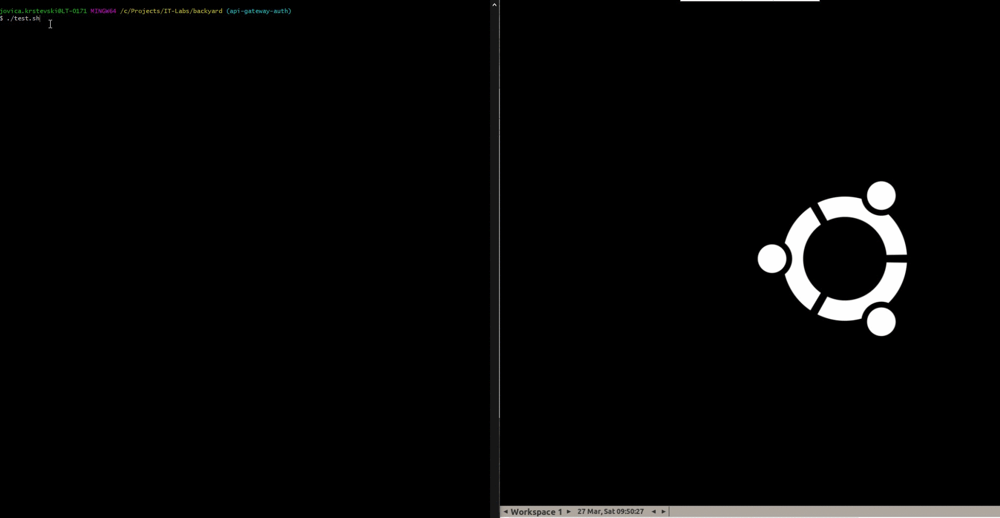

# Introduction

Purpose of this repository to give real working examples for development and testing the code.
This repository contains a full working local environment, where you can execute your application with minimum installed tools [setup](#root-setup).

[](https://github.com/IT-Labs/backyard/actions/workflows/codeql-analysis-api.yml)
[](https://github.com/IT-Labs/backyard/actions/workflows/codeql-analysis-api-config.yml)
[](https://github.com/IT-Labs/backyard/actions/workflows/codeql-analysis-api-gateway.yml)
[](https://github.com/IT-Labs/backyard/actions/workflows/codeql-analysis-script.yml)

## Stack

- Java 17
- Spring Boot 
- Gradle
- React
- Typescript
- Nightwatch
- Postgres
- Docker
- Docker compose
- Selenium grid
- Sonar
- Grafana
- Prometheus
- sitespeed.io
- Jmeter
- Keycloak
- Localstack s3
- AWS CLI docker 

# Readme

Following section describe which action can be performed, more details about the project can be found in

- api [readme](api/README.md)
- api gateway [readme](api-gateway/README.md)
- fe [readme](fe/app/README.md)
- e2e tests [readme](fe/e2e_tests/Readme.md)

## Component Diagram


# Local environment

For local development please check the Readme section for each project and install appropriate requirements

## Root setup

- Docker https://docs.docker.com/install/ and Docker compose https://docs.docker.com/compose/install/
- Ensure you are sharing the drive where you clone the project https://docs.docker.com/docker-for-windows/#resources
- Bash support for windows https://gitforwindows.org/
- VNC viewer [RealVNC](https://www.realvnc.com/en/connect/download/viewer/) for accessing selenium grid node when test are executed.
- Configure vnc: server-> localhost:5901, password-> secret, Name -> Chrome:5901

## keycloak

### Manual create the scopes and application

#### import realm json

[sample-realm](api/src/test/resources/sample-realm.json) json file
####Shell
Navigate to instance shell and execute
setup realm and client
` cd /opt/jboss/keycloak/bin \ && ./kcadm.sh config credentials --server http://localhost:6180/auth --realm master --user admin --password admin \ && ./kcadm.sh create realms -s realm=realm-sample -s enabled=true -o \ && ./kcadm.sh create -x "client-scopes" -r realm-sample -s name=user -s protocol=openid-connect \ && ./kcadm.sh create clients -r realm-sample -s clientId=sample-client -s enabled=true -s publicClient="true" -s directAccessGrantsEnabled="true" -s 'webOrigins=["*"]' -s 'redirectUris=["*"]' -s 'defaultClientScopes=["user", "web-origins", "profile", "roles", "email"]'`

Add manual client mapper for id to user_id from
. This script stops all parts which will be rebuild. If you want to rebuild single service, you can copy appropriate line and execute.

## Test

Following section present steps for running the test from scratch or repeating

- restart test environment: [restart.sh](restart.sh) path\to\repository; example : C:/Projects/IT-Labs/backyard
  example :`./restart.sh C:/Projects/IT-Labs/backyard`
- run test: [test.sh](test.sh) (If test(s) are not destructive (only read data from database) you can run them multiple times)
- example run : 

## Connect redis insight with redis

host: redis-sample
port :6379

## Volume backup

If you want to backup volume,because [restart.sh](restart.sh) is restoring your volume on each run
you should run the [backup script](volume_backup.sh)
example : `./volume_backup.sh C:/Projects/IT-Labs/backyard`

## Infra
 Run some of the infrastructure service by docker 
 ```docker-compose  -f "docker-compose-infrastructure.yml" up -d --build api-postgres redis-sample redis-insight ```

## Jmeter test

- download [jmeter](https://jmeter.apache.org/download_jmeter.cgi)

### Development (GUI mode)

- extract and run jmeter.(bat,sh)
- open existing .jmx files or create a new one in the following [location](jmeter/tests)

### Non-GUI mode run

this mode is using docker to run test, outputs can be found [location](jmeter)

- tune the test J parameters in jmeter.sh(jmeter.sh)
- jmeter.sh(jmeter.sh)

### Reports results

- html reports can be found [location](jmeter/reports)
- stats are send to graphite by using Backend Listener to Graphite
- Grafana (Coming soon)

## Performance test

### Dashboard and storage setup

- ensure api-postgres container is running (it is used by grafana to store credentials and dashboards)
- run [monitoring docker compose](docker-compose-monitoring.yml) `docker-compose -f "docker-compose-monitoring.yml" up -d`
- navigate to http://localhost:9092/ , credentials admin/admin

### SiteSpeed Run

restart test environment: [performance_test.sh](performance_test.sh) path\to\repository\metrics (NOTE : this path is required because is volume for results and contains urls for running)
example : `./performance_test.sh C:/Projects/IT-Labs/backyard/metrics`

### Visualize the test

- open VNC before running test
- open generated report json -> fe\e2e\*tests\reports\cucumber.json or generated html fe\e2e_tests\reports\test**\*\*\***.html
- open exported sitespeed.io [folder](metrics)
- open http://localhost:9092/dashboards

### Links

- https://www.sitespeed.io/documentation/sitespeed.io/configuration/
- https://www.sitespeed.io/documentation/sitespeed.io/lighthouse/
- https://www.sitespeed.io/documentation/sitespeed.io/performance-dashboard/#up-and-running-in-almost-5-minutes
- https://grafana.com/grafana/dashboards/10288
- https://github.com/sitespeedio/grafana-bootstrap-docker/tree/main/dashboards/graphite
- [Configure redis insight](https://docs.redislabs.com/latest/ri/using-redisinsight/)
- https://hub.docker.com/r/amazon/aws-cli
-

## local stack
start local stack and aws s3 cli  docker compose services 
### create a bucket
- navigate to aws s3 CLI  
- run ` aws configure`
then enter
AWS Access Key ID [None]: sample
AWS Secret Access Key [None]: sample
Default region name [None]:
Default output format [None]:
- run the command to create a bucket
``` aws --endpoint-url=http://localstack-sample:4566 s3 mb s3://config-sample```
you should `get make_bucket: config-sample` as response
- navigate to http://localhost:4566/config-sample you should get a response :
`<ListBucketResult xmlns="http://s3.amazonaws.com/doc/2006-03-01/">
<Name>config-sample</Name>
<MaxKeys>1000</MaxKeys>
<IsTruncated>false</IsTruncated>
</ListBucketResult> `
  
  ### manage local stack  content 
 navigate to  root folder 
 - copy content to s3 bucket
 ```aws --endpoint-url=http://localstack-sample:4566 s3 cp ./myFolder/cloud-config s3://config-sample --recursive```
 remove content from s3 bucket 
 ```aws --endpoint-url=http://localstack-sample:4566 s3 rm s3://config-sample --recursive```

## Sonar

### Setup

#### WSL 2 setup :

this is solving the production elastic search setup : https://www.elastic.co/guide/en/elasticsearch/reference/current/docker.html#_set_vm_max_map_count_to_at_least_262144

- open powershell `wsl -d docker-desktop`
- `sysctl -w vm.max_map_count=262144`
  NOTE: for now this command must be run after each windows system restart

#### Run Sonar

- run `docker-compose -f docker-compose-sonar.yml up -d sonarqube-sample`
- navigate to sonar [admin](http://localhost:9001)
- login admin/admin
- create sample-api for java , generate token i paste in docker-compose-sonar.yml
- create sample-fe for fe , generate token i paste in docker-compose-sonar.yml

- run `docker-compose -f docker-compose-sonar.yml up -d sonar-fe` for FE analysis
- run `docker-compose -f docker-compose-sonar.yml up -d sonar-api` for API analysis
- run `docker-compose -f docker-compose-sonar.yml up -d sonar-api-gateway` for API gateway analysis
- remove all containers : `docker-compose -f docker-compose-sonar.yml down`


